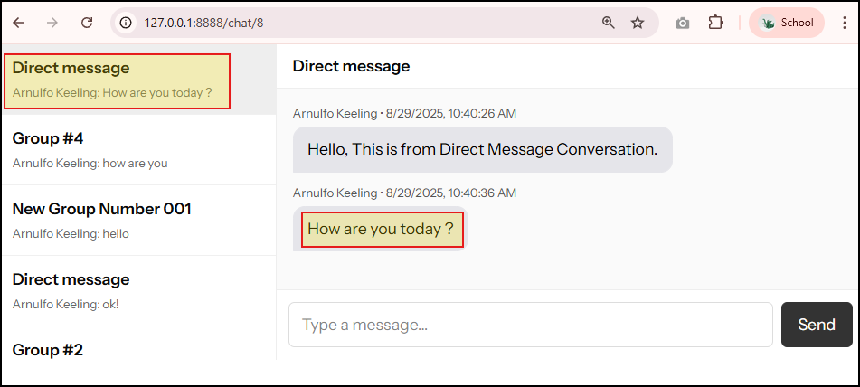

# HƯỚNG DẪN FIX LỖI KHI INSTALL LARAVEL/REVERB

## Lỗi hiển thị:


Lỗi này xảy ra vì `Laravel` khi khởi tạo driver `Pusher` để broadcast thì không tìm thấy hoặc không load được các biến môi trường cần thiết trong file `.env`.

Tập trung vào dòng lỗi này:

```bash
Pusher\Pusher::__construct(): Argument #1 ($auth_key) must be of type string, null given
```

> > Nghĩa là `$auth_key` đang bị _null_, tức là `PUSHER_APP_KEY` (hoặc các biến tương tự) chưa được set đúng.

## Nguyên nhân:

Trong file **.env** chưa có các biến cấu hình `Pusher`:

#### Thêm Cấu hình Pusher trong file .env:


_- Nếu các giá trị này không có, Laravel sẽ truyền null vào constructor của Pusher >> gây lỗi._
_- Sau khi hoàn tất setup cấu hình theo ảnh trên, nhớ bấm Ctr+F để search coi có bị trùng tên không nếu trùng thì comment nó lại giống vầy:_

_- Vì cấu hình trong `.env` không được trùng_

#### Clear cache config:

```bash
php artisan config:clear
php artisan cache:clear
```

#### Kiểm tra lại code trong file


Đoạn code trên dùng cho mục đích **TypeScript declaration merging** (khai báo mở rộng global types) để giúp TypeScript hiểu được các biến toàn cục (`window.Echo` và `window.Pusher`) mà bình thường TypeScript không biết.

##### Phân tích từng phần:

```ts
export {};
```

- Đây là cách chuyển đổi file thành một **module** trong TypeScript.
- Nếu không có dòng này, file `.d.ts` hoặc `.ts` sẽ được coi là **script toàn cục**, dễ gây trùng cho mỗi namespace.
- Khi đã là module, chúng ta có thể mở rộng các interface có sẵn như `Window`.

```ts
declare global {
    interface window {
        Echo: any;
        Pusher: any;
    }
}
```

1. `declare global { ... }`
   Mục đích Mở rộng (augment) các khai báo type toàn cục (global scope).

2. `interface window { ... }`
    - Ở đây chúng ta đang dùng **augment** interface `Window` của trình duyệt.
    - Object `Window` vốn đã tồn tại trong DOM lib (`lib.dom.d.ts`), nhưng không có thuộc tính `Echo` và `Pusher`.
    - TypeScript mặc định sẽ báo lỗi khi chúng ta viết `window.Echo = ...` hoặc `window.Pusher = ...` vì chắc chắn nó làm gì có type nào bên trong!.

3. `Echo: any; Pusher: any;`
    - Khai báo rằng `window` có thể có 2 thuộc tính mới là `Echo` và `Pusher`.
    - Kiểu `any` để tránh lỗi type-checking.
    - Sau này mở rộng dự án ra, chúng ta có thể thay `any` bằng type cụ thể (ví dụ: `LaravelEcho` hoặc `PusherStatic`).

##### Ví dụ thực tiễn

- Giúp TypeScript **không báo lỗi** khi chúng ta sử dụng lại module trên:

_Ở đây chúng ta thấy Echo & Pusher đã được sử dụng và gọi như 1 module._

```ts
window.Echo = new Echo({
    broadcaster: 'pusher',
    key: process.env.MIX_PUSHER_APP_KEY,
    cluster: process.env.MIX_PUSHER_APP_CLUSTER,
});

window.Pusher = Pusher;
```

- Nếu không có đoạn `declare global`, TypeScript sẽ báo lỗi:

    ```bash
    Property 'Echo' does not exist on type 'Window & typeof globalThis'.
    ```

## Chạy lại cài đặt LARAVEL REVERB:

```bash
composer require laravel/reverb
```


## Cài đặt hệ thống Broadcasting của Laravel:

```bash
npm i laravel-echo pusher-js
```

- `npm i laravel-echo pusher-js` >> Cài **thư viện frontend** để client (React/Vue/Blade) có thể kết nối tới Reverb/Pusher và lắng nghe các event real-time.

Vậy bây giờ chúng ta đã cài đặt thành công:

- **Backend**: Laravel broadcasting (Cấu hình Laravel server-side broadcasting với Reverb có thể tự chạy WebSocket server thay cho Pusher cloud).
- **Frontend**: Echo + PusherJS để subscribe và nhận sự kiện.

## Thêm ROUTES cho Broadcast Channel (khai báo quyền truy cập vào các kênh realtime)

**routes\channels.php**

Đoạn code trên định nghĩa **Broadcast Channel** trong Laravel – nơi khai báo **quyền truy cập** vào các kênh realtime.

#### 1. `Broadcast::channel('conversation.{conversationId}', ...)`

- Khai báo một channel có tên động: `conversation.{conversationId}`.
- `{conversationId}` là **wildcard** >> sẽ được thay bằng ID thật khi client subscribe.
  Ví dụ: `Echo.private('conversation.12')` thì `$conversationId = 12`.

#### 2. `function (User $user, int $conversationId)`

- Đây là **callback authorization function**.
- Laravel sẽ gọi function này khi một user cố gắng **subscribe** vào channel.
- `$user` là user đang login (tự động lấy từ guard).
- `$conversationId` là tham số lấy từ `{conversationId}` trong tên channel.

#### 3. Logic kiểm tra:

```php
return Conversation::whereKey($conversationId)
    ->whereHas('users', fn($q) => $q->whereKey($user->id))
    ->exists();
```

- `Conversation::whereKey($conversationId)`

    > > Lấy đúng record `conversation` theo ID.

- `->whereHas('users', fn($q) => $q->whereKey($user->id))`

    > > Kiểm tra trong mối quan hệ `users` của conversation đó có tồn tại user với ID bằng `$user->id` hay không.

- `->exists()`
    > > Nếu tồn tại >> trả về `true` (cho phép subscribe).
    > > Nếu không tồn tại >> `false` (bị từ chối).

##### Ý nghĩa

- Chỉ những user nào là **thành viên của conversation** mới được phép join vào channel realtime của cuộc trò chuyện đó.
- Nếu không, Laravel sẽ trả về **403 Forbidden** khi client cố subscribe.

##### Một Ví dụ để dễ hiểu hơn:

Hiện tại trong database có 2 tables là `conversations` và `conversation_user` (bảng trung gian).

- User **ID=5** cố subscribe (tham gia realtime) vào `conversation.10`.
- Laravel chạy function callback:
    - Tìm conversation ID=10.
    - Kiểm tra trong `conversation_user` có dữ liệu của `(conversation_id=10, user_id=5)` không.

- Nếu có >> cho phép join.
- Nếu không >> từ chối.

Đây là **authorization rule cho private channel**. Nó đảm bảo **chỉ thành viên trong conversation mới được nghe/broadcast sự kiện realtime của conversation đó**.

## Broadcast một Event qua Reverb

#### A. `php artisan vendor:publish --tag=reverb-config`

- Lệnh này publish file cấu hình `reverb.php` từ package Laravel Reverb ra thư mục `config/`.
- File này chứa:
    - Host, port mà Reverb server sẽ chạy.
    - Các option bảo mật (auth, TLS, v.v).

Sau bước này mở thư mục config/ ra sẽ thấy file:

```
config/reverb.php
```

#### B. `php artisan make:event MessageCreated`

- Tạo một class Event mới ở thư mục:

    ```
    app/Events/MessageCreated.php
    ```

Chỉnh lại code event để **broadcast được**:


##### 1. Import và class definition

```php
use App\Models\Message;
use Illuminate\Broadcasting\InteractsWithSockets;
use Illuminate\Broadcasting\PrivateChannel;
use Illuminate\Foundation\Events\Dispatchable;
use Illuminate\Queue\SerializesModels;

class MessageCreated
{
    use Dispatchable, InteractsWithSockets, SerializesModels;
```

- **`Dispatchable`**: Cho phép event được dispatch bằng `MessageCreated::dispatch($message)`.
- **`InteractsWithSockets`**: Hỗ trợ khi dùng broadcasting, giúp tránh gửi lại event cho chính user đã tạo ra event đó (ngăn vòng lặp socket).
- **`SerializesModels`**: Tự động serialize/deserialize model (`Message`) khi event được đưa vào queue.

##### 2. Constructor

```php
public function __construct(public Message $message) {}
```

- Nhận một instance `Message` khi event được tạo ra.
- Ở đây chúng ta viết rút gọn: `public Message $message` thay vì khai báo property thủ công.

##### 3. broadcastOn()

```php
public function broadcastOn(): array
{
    return [
        new PrivateChannel('conversation.' . $this->message->conversation_id)
    ];
}
```

- Xác định **channel** mà event này sẽ được broadcast đến.
- Ở đây: `conversation.{conversation_id}` (ví dụ: `conversation.10`).
- `PrivateChannel` nghĩa là channel này **cần authorize** (xem ở `routes/channels.php`).
- Trả về array vì một event có thể phát lên nhiều channel.

##### 4. broadcastAs()

```php
public function broadcastAs(): string
{
    return 'MessageCreated';
}
```

- Đặt tên event khi broadcast ra ngoài.
- Trên frontend, client sẽ nghe sự kiện này với `listen('.MessageCreated', callback)`.

##### 5. broadcastWith()

```php
public function broadcastWith(): array
{
    return [
        'message' => [
            'id'        => $this->message->id,
            'body'      => $this->message->body,
            'created_at'=> $this->message->created_at->toISOString(),
            'user'      => [
                'id'   => $this->message->user_id,
                'name' => $this->message->user?->name ?? '',
            ],
        ]
    ];
}
```

- Xác định **payload** (data) được gửi ra channel.
- Ở đây, chúng ta đang phát một JSON có cấu trúc như ví dụ dưới:

    ```json
    {
        "message": {
            "id": 123,
            "body": "Hello world",
            "created_at": "2025-08-29T12:34:56Z",
            "user": {
                "id": 5,
                "name": "John"
            }
        }
    }
    ```

- `user?->name ?? ''`: Dùng **nullsafe operator** để tránh lỗi nếu `$message->user` không tồn tại.

##### Luồng hoạt động tổng thể

1. User gửi tin nhắn → Controller tạo record `Message`.
2. Gọi `MessageCreated::dispatch($message)`.
3. Laravel broadcast event này qua **Reverb server** trên channel `conversation.{id}`.
4. Frontend (Echo) subscribe vào `conversation.{id}`:

    ```js
    Echo.private(`conversation.${conversationId}`).listen('.MessageCreated', (e) => {
        console.log(e.message);
    });
    ```

5. Client nhận object JSON như trên >> hiển thị ngay tin nhắn realtime.

**Tóm lại:**:
Class này định nghĩa rõ:

- **Event phát đi đâu** (`broadcastOn`)
- **Tên gì trên frontend** (`broadcastAs`)
- **Payload kèm theo** (`broadcastWith`)

Nhờ đó, client (Echo) có thể nhận đúng dữ liệu cần để hiển thị tin nhắn mới realtime.

---

#### 3. Trigger Event

Khởi tạo Controller: `MessageController` sau khi lưu message ta buộc phải gọi:

```php
MessageCreated::dispatch($message);
```

Laravel sẽ tự động broadcast qua **Reverb server**.

Chạy command line:

```bash
php artisan make:controller MessageController
```

app\Http\Controllers\MessageController.php


Phân tích `MessageController@store`

##### Mục đích:

- Nhận POST từ form chat
- Xác thực dữ liệu và quyền truy cập vào cuộc trò chuyện
- Ghi bản ghi `messages`
- Eager-load `user` để payload broadcast đầy đủ
- Phát `MessageCreated` (real-time)
- Cập nhật `updated_at` của `conversations` để sắp xếp theo hoạt động mới nhất
- Redirect về trang trước

##### Giải thích:

```php
public function store(Request $request): RedirectResponse
{
    $userId = $request->user()->id;
```

- Lấy **ID user đang đăng nhập** từ guard mặc định. Mọi thao tác tiếp theo gắn chặt với user này.

```php
    $data = $request->validate([
        'conversation_id' => ['required', 'exists:conversations,id'],
        'body'            => ['nullable', 'string', 'max:5000'],
    ]);
```

- Trước khi lưu hay lấy data đều phải xác thực **Validation** !!!:
    - `conversation_id` bắt buộc và phải tồn tại trong bảng `conversations`.
    - `body` cho phép rỗng (nullable), là chuỗi, tối đa 5000 ký tự.
- Nếu sai rule → Laravel trả 422, dừng luồng.

```php
    $conversation = Conversation::findOrFail($data['conversation_id']);
```

- Tải **Conversation** theo khóa chính. Nếu không có >> 404.

```php
    abort_unless($conversation->isParticipant($userId), 403);
```

- **Authorization cấp business**: chỉ cho phép thành viên của conversation gửi tin.
- `isParticipant()` sẽ kiểm tra table trung gian `conversation_user` coi bên trong nó có (conversation_id, user_id) tương ứng không.
- Không phải thành viên >> 403.

```php
    $created = $conversation->messages()->create([
        'user_id' => $userId,
        'body'    => $data['body'] ?? '',
    ]);
```

- Tạo bản ghi `messages` qua **quan hệ** `Conversation::messages()`:
    - Gắn `user_id` người gửi
    - `body` cho phép rỗng.

```php
    $created->load('user:id,name');
```

- **Eager-load** quan hệ `user` (chỉ lấy `id,name`) để:
    - Giảm N+1 khi serialize
    - Đảm bảo payload của event có đủ thông tin người gửi (khớp với hàm `broadcastWith()` đã viết).

```php
    MessageCreated::dispatch($created);
```

- **Phát event domain**. Nếu event `MessageCreated` **implements `ShouldBroadcast`**:
    - Laravel sẽ broadcast tới channel (ví dụ `PrivateChannel('conversation.{id}')`)
    - Tên event bên client là `.MessageCreated` (do `broadcastAs()`), payload theo `broadcastWith()`.

```php
    $conversation->touch();
```

- **Cập nhật `updated_at`** của cuộc trò chuyện để danh sách hội thoại sắp xếp theo hoạt động mới nhất (nằm bên thanh sidebar chat bên trái).

```php
return to_route('chat.show', $conversation)->setStatusCode(303);
```

303 buộc trình duyệt thực hiện **GET** sau POST.

#### 5. Khởi động Reverb Server cùng với lệnh composer run dev:

Thêm lệnh này:

```bash
php artisan reverb:start
```

Vào composer.json

```json
"dev": [
    "Composer\\Config::disableProcessTimeout",
    "npx concurrently -c \"#93c5fd,#c4b5fd,#fdba74\" \"php artisan serve\" \"php artisan queue:listen --tries=1\" \"npm run dev\" --names='server,queue,vite' \"php artisan reverb:start\" "
    ],
```

\>> Mặc định mở WebSocket server ở cổng 8080.
Bây giờ client sẽ connect và nhận event.

#### 6. Thêm ROUTES:


Sau đó chạy server như bình thường, để ý sẽ thấy nó xuất hiện thêm 1 port mới của reverb:


---

## Hướng dẫn fix một số lỗi phổ biến:

### Trong quá trình chạy nếu bị lỗi như ảnh:


Thì mở file:
**resources\js\components\chat\MessageInput.tsx**
Chỉnh lại khoảng dòng code thứ 8 hoặc 9 tùy thông báo lỗi:

- dấu `=` thành dấu `:`
- `conversation_Id` key thành `conversation_id`
  

### Nếu gặp lỗi như ảnh:


thì vào file `MessageInput.tsx` và import useRef vào, bấm `Ctrl+Spacebar`:


Sau đó qua bên resources\js\pages\Chat\Show.tsx
chỉnh lại đoạn dependencies như sau:


### Nếu gặp lỗi như ảnh:


Chạy lại server sẽ hết

### Lỗi bấm chọn 1 người không tạo Conversation Direct Message (chat 1 - 1) được:


`app\Http\Controllers\ConversationController.php`
sửa validation của method store bên ConversationController từ `required` thành `nullable`

### Lỗi Direct message nhưng lại hiển thị Group + id (Group #${c.id}):
`resources\js\components\chat\ConversationList.tsx`
chỉnh lại câu lệnh điều kiện như bên dưới.
```tsx
<div className="conv-title">{c.name || (c.is_direct ? 'Direct message' : `Group #${c.id}`)}</div>
```

Thêm class name để có css phù hợp:


---

## Hướng dẫn test Chat App:

### Bước 1: Tạo Conversation:

#### Private Chat (isDirect = true/1)


Chỉ chọn 1 person sau đó bấm `Create`.


Quan sát thấy đoạn trích dẫn 40 ký tự bên dưới khung Conversation bên trái

#### Group Chat (isDirect = false/0)


Để tạo group yêu cầu phải chọn ít nhất 2 persons:


---

Vậy là xong !!!
*Trong trường hợp vẫn bị lỗi có thể tham khảo source đi chung với bài hướng dẫn này!*
